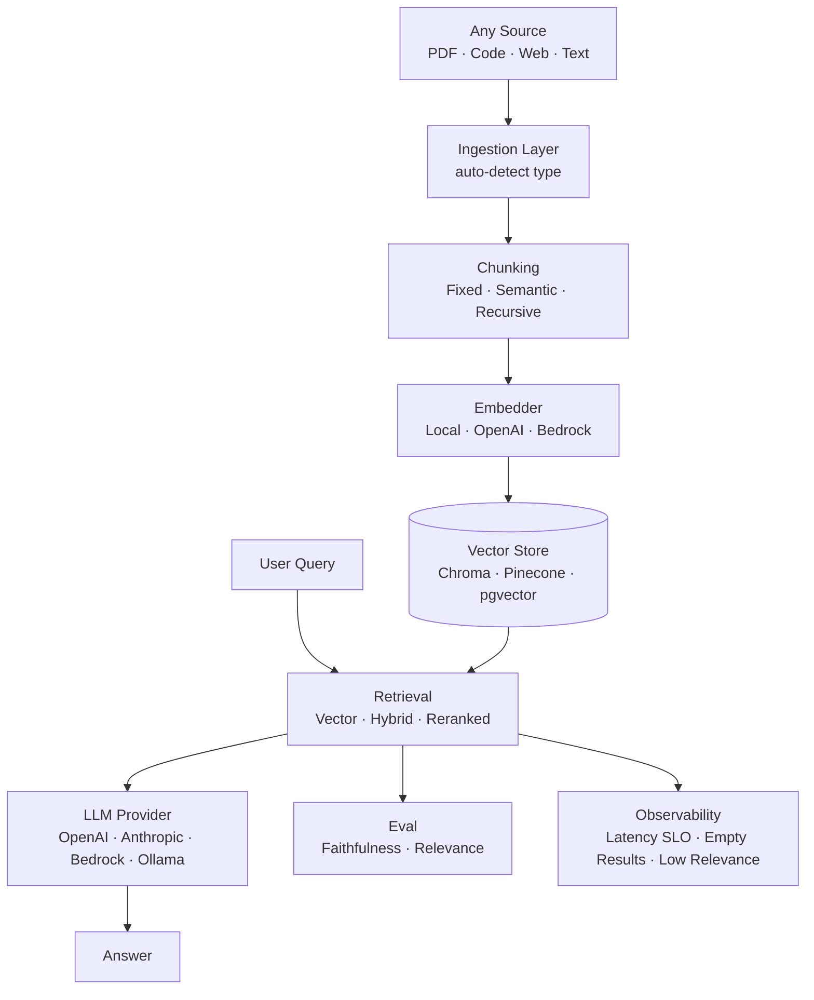

# rag-patterns


Production RAG patterns in Python — multimodal ingestion (PDF, images, audio, code, web, text), composable chunking strategies, hybrid retrieval, LLM-as-judge evaluation, real-time observability, and Kafka-backed event streaming. Works with any LLM provider (OpenAI, Anthropic, Bedrock, Gemini, Ollama), any vector store.

Built against patterns used in production AI platforms that process millions of documents and queries daily.

---

## The Problem → Solution → Impact

| | |
|---|---|
| **Problem** | RAG systems fail silently. Wrong chunk size loses context. Auto-commit retrieval has no quality signal. Hallucinations are invisible until users report them. No two providers behave the same way. |
| **Solution** | Five composable patterns: multimodal ingestion, three chunking strategies with benchmarking, hybrid retrieval with reranking, LLM-as-judge evaluation, and real-time retrieval observability. |
| **Impact** | Measurable retrieval quality, grounded answers, provider-agnostic deployment, and anomaly detection before users notice degradation. |

---

## System Design



---

## Patterns

### 1. Multimodal Ingestion

```python
from python.ingestion.document import load

# Auto-detects source type — same API for everything
pdf_docs    = load("research_paper.pdf")
code_docs   = load("./my-repository/")
web_docs    = load("https://docs.example.com/api")
text_docs   = load("notes.md")

# Every source produces the same Document object
doc = pdf_docs[0]
print(doc.source_type)   # SourceType.PDF
print(doc.word_count)    # 1842
print(doc.metadata)      # {"page": 1, "total_pages": 12}
```

**Supported:** PDF (layout-preserving), source code repos (language detection, .gitignore aware), web pages (boilerplate stripped), plain text / markdown.

---

### 2. Chunking Strategies — Benchmarked

```python
from python.chunking.strategies import FixedChunker, SemanticChunker, RecursiveChunker
from python.chunking.benchmark import benchmark

# Compare all three strategies on your content
results = benchmark(document_text)
for strategy, stats in results.items():
    print(stats)

# [fixed]     chunks=24 avg=512chars min=64  max=512  std=58  ~341tokens/chunk
# [semantic]  chunks=18 avg=687chars min=120 max=982  std=201 ~458tokens/chunk
# [recursive] chunks=21 avg=523chars min=45  max=512  std=89  ~349tokens/chunk

# Use the strategy that fits your content
chunks = SemanticChunker(max_chars=1000).chunk(text, source="doc.pdf")
```

**Why chunking strategy matters:** Fixed chunking is fast and predictable but splits sentences. Semantic chunking preserves sentence boundaries but produces variable-size chunks. Recursive chunking respects document structure (paragraphs → sentences → words). Run `benchmark()` before committing to a strategy.

---

### 3. Hybrid Retrieval with Reranking

```python
from python.retrieval.pipeline import VectorRetriever, HybridRetriever, RerankedRetriever
from python.providers.embeddings import Embedder, EmbeddingProvider
from python.providers.vector_store import VectorStore, VectorStoreConfig

embedder = Embedder(EmbeddingProvider.LOCAL)   # no API key needed
store = VectorStore(VectorStoreConfig())

# Choose retrieval strategy
retriever = HybridRetriever(store=store, embedder=embedder)
retriever.index(chunks)

result = retriever.retrieve("How does chunking affect retrieval quality?", top_k=5)
print(result.strategy)       # "hybrid"
print(result.latency_ms)     # 23.4
print(result.context(n=3))   # top 3 chunks joined for LLM context
```

**Three retrieval patterns:**
- `VectorRetriever` — dense embedding similarity. Fast, semantic.
- `HybridRetriever` — dense + BM25 with Reciprocal Rank Fusion. Best recall.
- `RerankedRetriever` — hybrid retrieval + cross-encoder reranking. Best precision.

---

### 4. Multi-Model LLM Provider

```python
from python.providers.llm import LLMProvider, LLMConfig, Provider

# Swap providers via config — no code changes downstream
config = LLMConfig(provider=Provider.ANTHROPIC, model="claude-3-5-sonnet-20241022")
# config = LLMConfig(provider=Provider.OPENAI, model="gpt-4o")
# config = LLMConfig(provider=Provider.BEDROCK, model="anthropic.claude-3-5-sonnet-20241022-v2:0")
# config = LLMConfig(provider=Provider.OLLAMA, model="llama3.2")

llm = LLMProvider(config)
response = llm.complete(
    query="What is hybrid retrieval?",
    context=result.context(n=5),
)
print(response.content)
print(f"Tokens: {response.total_tokens} | Cost: ${response.cost_usd:.4f} | Latency: {response.latency_ms:.0f}ms")
```

---

### 5. RAG Evaluation

```python
from python.eval.metrics import RAGEvaluator, EvalPipeline

evaluator = RAGEvaluator(llm=llm)
eval_result = evaluator.evaluate(
    query="What is hybrid retrieval?",
    answer=response.content,
    retrieval=result,
)
print(eval_result)
# EvalResult(
#   faithfulness=0.92 (FAITHFUL)
#   relevance=0.87 (RELEVANT)
#   overall=0.90
#   latency=234ms
#   cost=$0.0042
# )
```

**Faithfulness** measures whether the answer is grounded in retrieved context (not hallucinated). **Relevance** measures whether retrieved chunks actually address the query. Both use LLM-as-judge — the same approach as RAGAS.

---

### 6. Retrieval Observability

```python
from python.observability.retrieval_monitor import RetrievalMonitor

monitor = RetrievalMonitor(latency_slo_ms=500, min_relevance_score=0.3)

result = retriever.retrieve(query)
event = monitor.record(result, caller_id="chat-api")
anomalies = monitor.check(event)

for a in anomalies:
    if a.severity == "PAGE":
        alert_oncall(str(a))
# [PAGE] LATENCY_SLO vector: latency=1240ms exceeds SLO 500ms
# [WARN] LOW_RELEVANCE hybrid: avg_score=0.21 below threshold 0.3

print(monitor.stats())
# {'total_queries': 247, 'avg_latency_ms': 89.3, 'avg_relevance_score': 0.74, 'total_anomalies': 3}
```

**Why stream retrieval telemetry:** At production scale, batch analytics miss latency spikes and relevance degradation. Streaming every query enables SLO enforcement, per-caller quality tracking, and provider health monitoring in real time.

---

## Staff-Level Patterns

### 7. HyDE — Hypothetical Document Embedding

```python
from python.retrieval.hyde import HyDERetriever

retriever = HyDERetriever(llm=llm, embedder=embedder, store=store)
retriever.index(chunks)
result = retriever.retrieve("What causes a thundering herd in distributed systems?")
print(result.hypothetical_document)
# "A thundering herd occurs when many processes simultaneously wake up and
#  compete for a shared resource, causing overload..."
# This embedding finds better documents than the question embedding alone.
```

### 8. Query Decomposition

```python
from python.retrieval.query_decomposer import QueryDecomposer

decomposer = QueryDecomposer(llm=llm, retriever=retriever, n_subqueries=3)
result = decomposer.retrieve("Compare hybrid retrieval and vector-only for code search")
print(result.sub_queries)
# ["What is hybrid retrieval?", "What is vector retrieval?",
#  "How do retrieval methods compare for code search?"]
print(f"Merged {len(result.merged_results)} unique chunks from {len(result.sub_queries)} sub-queries")
```

### 9. Agentic RAG — Self-Correcting Retrieval

```python
from python.retrieval.agentic import AgenticRetriever

agent = AgenticRetriever(llm=llm, retriever=retriever, max_iterations=3)
agent.index(chunks)
result = agent.run("Explain all tradeoffs between chunking strategies")
print(f"Converged: {result.converged} in {result.total_iterations} iterations")
print(result.final_answer)
# Step 1: retrieve → evaluate → "context insufficient, missing recursive chunking details"
# Step 2: reformulate query → retrieve again → "sufficient"
# Step 3: generate final answer with complete context
```

### 10. RAPTOR — Recursive Summarization Tree

```python
from python.chunking.raptor import RaptorBuilder

builder = RaptorBuilder(llm=llm, max_levels=3, cluster_size=5)
all_chunks = builder.build(base_chunks)
# base_chunks: 50 leaf chunks (level 0)
# all_chunks:  50 + 10 summaries (level 1) + 2 summaries (level 2) = 62 total
# Index all_chunks — retrieval searches every level simultaneously
retriever.index(all_chunks)
```

### 11. Role-Based Retrieval Access Control

```python
from python.retrieval.access_control import AccessControlledRetriever

# Wrap any existing retriever — VectorRetriever, HybridRetriever, RerankedRetriever
retriever = AccessControlledRetriever(HybridRetriever(store=store, embedder=embedder))

# Chunks carry an "allowed_roles" metadata tag set at index time
retriever.index(chunks)   # e.g. chunk.metadata = {"allowed_roles": ["finance"]}

result = retriever.retrieve("Q4 budget projections", caller_roles=("finance",), top_k=5)
print(result.denied_count)          # chunks filtered out for this caller
for event in retriever.audit_log:   # defensibility / compliance trail
    print(event.to_dict())
# {'event_id': '...', 'caller_roles': ['finance'], 'total_candidates': 15,
#  'permitted_count': 4, 'denied_count': 11, 'denied_sources': ['eng.md', ...]}
```

| | |
|---|---|
| **Problem** | A shared vector store mixes documents scoped to different teams, customers, or sensitivity levels. Retrieval has no notion of who's asking — whatever's in the corpus reaches the LLM context (and the end user) regardless of authorization. |
| **Solution** | Tag chunks with the role(s) required to view them, then filter retrieved candidates by the caller's granted roles *before* they're assembled into context — filtering happens outside the LLM, not via a prompt instruction. Every filtering decision is logged to an audit trail. |
| **Impact** | No unauthorized document ever reaches the context window. Fails closed by default: missing ACL metadata or an unauthenticated caller is denied, not treated as public — the safer default for a security-relevant filter. |

**Why fail closed:** many ad-hoc ACL implementations default to "allow" when metadata is absent, because it's the path of least friction during development. That default silently turns every un-tagged document into an accidental leak the moment real data lands in the corpus. `AccessControlledRetriever` denies by default — a document must be explicitly tagged with `allowed_roles` to be retrievable at all.

---

### 12. Semantic Caching

```python
from python.retrieval.semantic_cache import SemanticCache

cache = SemanticCache(embedder=embedder, similarity_threshold=0.92, ttl_seconds=300)

cached = cache.get("What impact does chunk size have on retrieval quality?")
if cached.hit:
    print(cached.matched_query)   # "How does chunking affect retrieval quality?"
    print(cached.similarity)      # 0.979 — served without hitting the retriever/LLM
else:
    result = retriever.retrieve(query)
    cache.set(query, result)

print(cache.stats())
# {'size': 1, 'hits': 1, 'misses': 1, 'hit_rate': 0.5}
```

| | |
|---|---|
| **Problem** | Exact-match caching misses on paraphrases — "How does chunking affect retrieval quality?" and "What impact does chunk size have on retrieval quality?" are the same question but different cache keys, so every rewording pays full retrieval + generation cost and latency again. |
| **Solution** | Embed the incoming query and compare it against cached query embeddings by cosine similarity. A hit means "semantically close enough" (above a configurable threshold), not "identical text." Entries expire on a TTL and the oldest entry is evicted once the cache exceeds a max size. |
| **Impact** | Paraphrased queries with the same intent reuse a prior result instead of re-running retrieval and generation — lower latency and cost on repeat-intent traffic, with a tunable threshold to trade hit rate against precision. |

**Why cosine similarity, not embedding-store lookup:** the cache is small and short-lived by design (bounded by `max_size` and `ttl_seconds`), so a linear scan over cached embeddings is fast enough without standing up a second vector index just for the cache layer.

---

### 13. Guardrails — Input/Output Validation

```python
from python.eval.guardrails import Guardrails, OutputVerdict

guardrails = Guardrails(max_input_length=2000)

input_result = guardrails.check_input(user_query)
if not input_result.allowed:
    return refuse(input_result.reasons)
# e.g. reasons=["matched 1 prompt-injection pattern(s)"]

response = llm.complete(user_query, context=context)
output_result = guardrails.check_output(response.content)

if output_result.verdict == OutputVerdict.FLAGGED:
    log_silent_failure(output_result)   # model refused/deflected — don't treat as success

return output_result.text   # PII already redacted: "Contact [REDACTED_EMAIL] for details."
```

| | |
|---|---|
| **Problem** | Two RAG failure modes look identical to "it worked" unless something checks for them: a crafted query overriding system instructions (prompt injection), and a response that silently refuses or leaks PII pulled from retrieved context. Neither raises an exception. |
| **Solution** | Validate input before it reaches a prompt (length limits, prompt-injection heuristics) and validate output before it reaches the caller (PII detection + redaction, refusal-pattern detection). Both run outside the LLM call, so they catch what the model has no incentive to flag itself. |
| **Impact** | Prompt-injection attempts and oversized queries are blocked before generation runs. PII never reaches the caller unredacted. Silent refusals are surfaced as a distinct, loggable verdict instead of looking like a successful answer. |

**Why regex heuristics, not a classifier:** these checks run with no external services and no model calls — good enough to catch common shapes (SSNs, emails, "ignore previous instructions" phrasing) offline and deterministically. `InputGuardrail` / `OutputGuardrail` take custom pattern lists, so a real PII/injection classifier can sit behind the same interface in production.

---

## Project Structure

```
rag-patterns/
├── python/
│   ├── ingestion/
│   │   ├── document.py              # Auto-detect loader + SourceType enum
│   │   ├── image_loader.py          # OCR via Tesseract / EasyOCR
│   │   └── audio_loader.py          # Transcription via Whisper
│   ├── chunking/
│   │   ├── strategies.py            # Fixed, Semantic, Recursive chunkers
│   │   ├── benchmark.py             # Compare strategies with quality stats
│   │   └── raptor.py                # Recursive summarization tree (Staff)
│   ├── retrieval/
│   │   ├── pipeline.py              # Vector, Hybrid (RRF), Reranked retrieval
│   │   ├── hyde.py                  # Hypothetical Document Embedding (Staff)
│   │   ├── query_decomposer.py      # Multi-hop query decomposition (Staff)
│   │   ├── agentic.py               # Self-correcting retrieval loop (Staff)
│   │   ├── access_control.py        # Role-based retrieval filtering + audit log
│   │   └── semantic_cache.py        # Similarity-keyed cache with TTL + eviction
│   ├── providers/
│   │   ├── llm.py                   # OpenAI, Anthropic, Bedrock, Gemini, Ollama
│   │   ├── embeddings.py            # Local (sentence-transformers), OpenAI, Mock
│   │   └── vector_store.py          # ChromaDB, Pinecone, pgvector
│   ├── eval/
│   │   ├── metrics.py               # Faithfulness, relevance, eval pipeline
│   │   ├── dashboard.py             # Self-contained HTML eval report + charts
│   │   └── guardrails.py            # Input/output validation: injection, PII, refusals
│   └── observability/
│       ├── retrieval_monitor.py     # Real-time anomaly detection (in-memory)
│       └── kafka_stream.py          # Kafka-backed retrieval event streaming
├── python/query/
│   └── merger.py                    # ConcatMerger, SummaryMerger, StructuredMerger
└── python/tests/                    # 147 tests — all patterns covered
```

---

## Design Decisions & Trade-offs

**Hybrid retrieval over pure vector search:**
Dense vector search finds semantically similar documents but misses exact keyword matches (product IDs, names, code symbols). BM25 catches exact matches but misses paraphrasing. Reciprocal Rank Fusion merges both ranked lists without needing a learned weight — works out of the box.

**Eval as a first-class pattern:**
Most RAG implementations skip evaluation until production failures expose the problem. Faithfulness and relevance scores should be part of every retrieval loop in development — not an afterthought.

**Provider abstraction via config:**
Switching LLM providers should not require code changes. Every provider returns the same `LLMResponse` with tokens, cost, and latency — so observability and eval work identically regardless of which model you use.

**Mock embeddings for tests:**
Tests don't need real embeddings or API keys. The `MockEmbedder` generates deterministic, normalized vectors from text hashes — fast, offline, and consistent across runs.

---

## Running Tests

```bash
pip install chromadb rank-bm25 requests beautifulsoup4 pypdf pytest
pytest python/tests/ -v
```

---

## Part of the Agentic Infrastructure Stack

| Repo | What It Is |
|------|-----------|
| **[kafka-patterns](https://github.com/TushGoel/kafka-patterns)** | Kafka producer/consumer patterns + LLM inference telemetry |
| **[workflow-orchestration-patterns](https://github.com/TushGoel/workflow-orchestration-patterns)** | Step Functions + SQS orchestration |
| **[platform-observability](https://github.com/TushGoel/platform-observability)** | SLOs for event pipeline reliability |
| **[rag-patterns](https://github.com/TushGoel/rag-patterns)** | ← You are here: RAG ingestion, retrieval, eval, observability |

---

## License

MIT
